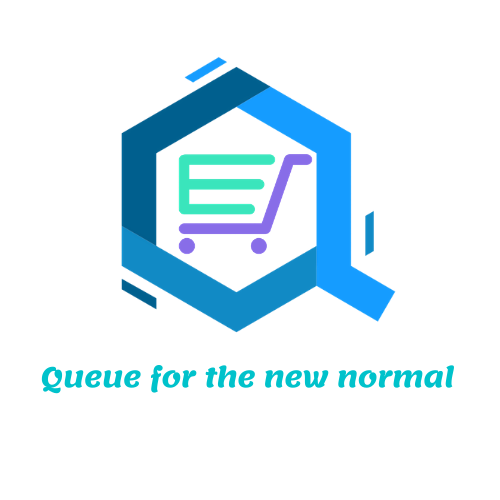

# eQ
Queue for the new normal



## Table of Contents
* [General Info](#general-info)
* [Website](#website)
* [Problem](#problem)
* [Our Solution](#our-solution) 
* [Technologies](#technologies)
* [Installation](#installation)
* [How to Contribute](#how-to-contribute)

## General Info

Members: [SK Shahnawaz](https://github.com/skshahnawaz), [Swadesh Jana](https://github.com/Swadesh13), [Moinuddin Mondal](https://github.com/zulkernine), [Neeladri Pal](https://github.com/neeladriOO7), Arpan Mukherjee, Samayan Bhattacharya

Institute Name: Jadavpur University

## Deployed Website
URL: 

## Problem 

Covid19 - Recovery and Return to normal

## Our Solution
The problem eQ solves :- 
Since we are facing critical situation due to the COVID 19 pandemic. To win against this pandemic and to come out of this situation most crucial thing we have to follow is social-distancing. But, the problem is people are panicking and are rushing to get their basic daily-life commodities like milk, water, grocery, medicines etc. to the nearby shop's and coming in contact with various people at the cash counters. Because of this behaviour, gathering at the same place (mostly at the same time) they are risking their as well as others life by not following SOCIAL DISTANCING.

So we came up with an idea to deal with the present situation and making things happen in a smooth and DISCIPLINED manner for the people. We are developing an automated system by which every individual can get their essential commodities without being in crowd and waiting in queues outside of shops. In our system eQ we are providing features so that every indivual can find shops nearby their location as per their requirement.

In our webapp, we are creating two interfaces, one for the buyers' and other for the sellers. We would be taking shop opening and closing time and time required per customer for one transaction. With the help of this data, we would provide slots to users so that as per the slot given time the shop would be empty of other customers. Slots would be given as per availability, availability of commodities needed (by the user) and seller's permission.

It would also help social workers who are arranging food and other commodities for charity and distribution among the less-priviledged as they could pre-book a slot and arrange their huge requirement of goods at an empty shop (with no crowd) in an easy and hassle-free manner.

Complete eradication of waiting time and roaming of people from one shop to another in search of their commodity. At last we strongly believe that this way we can stop and slow down the spread of the virus.

## Technologies
The Technologies used for this tool are :-

* Material UI
* Firebase Cloud Functions
* Cloud Firestore

The Following Programming Languages have been used :-
1. React JS
2. Node JS
3. HTML

## Installation
#### Clone
>Clone this repository:
```
$ git clone https://github.com/Swadesh13/ShopSafe
``` 
#### Prerequisities
* Install node 12.18.* (including npm 6.14.*) from here [here](https://nodejs.org/en/download/)

## How to Contribute

1. Clone repo and create a new branch: `$ git checkout https://github.com/Swadesh13/ShopSafe.git -b name_for_new_branch`.
2. Make changes and test
3. Submit Pull Request with comprehensive description of changes